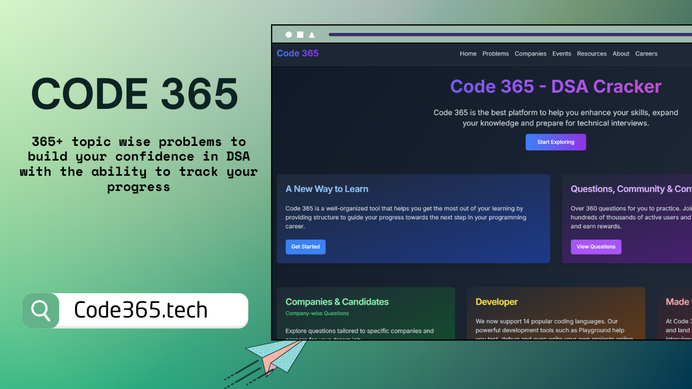
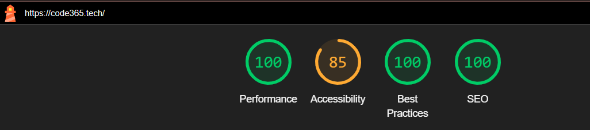

# Code365
   
[](https://www.npmjs.com/)
[](https://www.code365.tech/)
[](https://www.gnu.org/licenses/gpl-3.0)
[](https://github.com/rohith2201/Code365)
<br>
[](https://reactjs.org/)
[](https://nextjs.org/)
[](https://www.code365.tech/)


## Overview 👀



## Our Mission
At Code 365, my mission is to empower aspiring programmers and experienced developers alike to master Data Structures and Algorithms (DSA). I believe that a strong foundation in these fundamental concepts is crucial for success in the ever-evolving world of technology.

I Designed platform to provide a structured, comprehensive, and engaging learning experience that caters to learners at all levels. Whether you're preparing for job interviews, competitive programming contests, or simply want to sharpen your problem-solving skills, Code 365 is here to support your journey.

## What We Offer
- **360+ DSA Problems:** A curated collection of problems carefully selected to cover a wide range of topics and difficulty levels.
- **Company-Specific Question Sets:** Tailored question sets to help you prepare for interviews at top tech companies.
- **Community Support:** An active community of learners and experienced developers for collaboration and support.
- **Progress Tracking:** Tools to monitor your growth and identify areas for improvement.
- **Contests and Challenges:** Regular events to test your skills and compete with peers.

## Meet The Developer
**Rohith Juluru**  
Lead Developer  

## PageSpeed Insights


## Tech Used


[](https://vercel.com/)


<details>
<summary>
  NextJS Guide
</summary>

## Getting Started

### Prerequisites
Make sure you have the following installed:
- Node.js (v16 or later)
- npm (Node Package Manager)

### Installation
1. Clone the repository:
   ```bash
   git clone <repository-url>
   cd code-365
   ```

2. Install the dependencies:
   ```bash
   npm install
   ```

3. Run the development server:
   ```bash
   npm run dev
   ```

4. Open your browser and navigate to `http://localhost:3000` to access the platform.

### Required Files
Before running the platform, ensure the following files are created in the `lib` directory:

1. **problem.json**
   - Contains the list of DSA problems with their respective details.

2. **company-questions.json**
   - Includes company-specific questions to help users prepare for interviews.

The structure and format of these files should follow the JSON schema used by the platform.

</details>

## Contributing
We welcome contributions from the community! If you have ideas, suggestions, or would like to contribute code, feel free to submit a pull request or create an issue.


---

### License
Code 365 is open-source and distributed under the MIT License. See `LICENSE` for more details.

This project is built with the following technologies:
<div align="center">

</div>

---
#### Curated list of question in [Code365] is based on _[DSA Cracker Sheet]_ by [Love Babbar]
[Code365]: https://www.code365.tech/
[love babbar]: https://www.linkedin.com/in/love-babbar-38ab2887/
[dsa cracker sheet]: https://drive.google.com/file/d/1FMdN_OCfOI0iAeDlqswCiC2DZzD4nPsb/view
